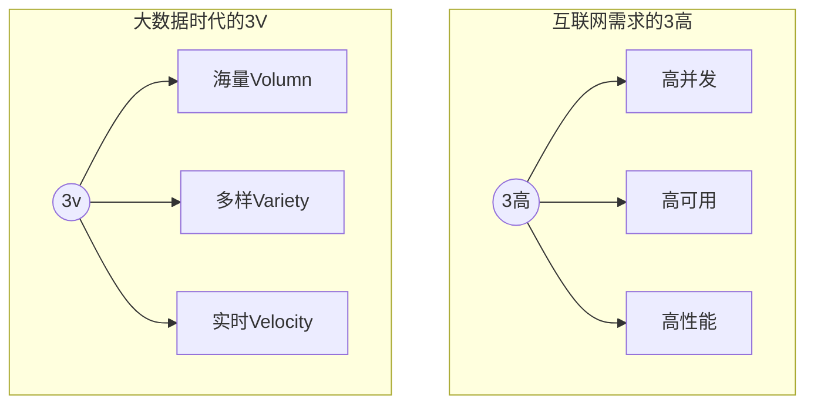

## Redis简介

### 简单介绍

Redis：开源、免费、非关系型数据库、K-V数据库、内存数据库，支持持久化、事务和备份，集群(支持16个库)等高可用功能。并且性能极高(可以达到100000+的QPS)，易扩展，丰富的数据类型，所有操作都是单线程,原子性的。

**NOSQL**：非关系型数据库，数据与数据之间没有关联关系。就是为了解决大规模数据集合多重数据种类带来的挑战，尤其是大数据应用难题

类型

1. 键值(key-value)存储数据库
2. 列存储数据库：键仍然存在，但是指向了多个列，HBase (eg：博客平台(标签和文章)，日志)
3. 文档型数据库 MongoDb  (eg：淘宝商品的评价)
4. 图形数据库 Neo4j  （eg：好友列表）

> 扩展:
>
> MongoDB是一个基于分布式文件存储的数据库。有C++语言编写。旨在为WEB应用提供可扩展的高性能数据存储解决方案。
>
> MongoDB是一个介于关系型数据库和非关系型数据库之间的产品，是非关系数据库当中功能最丰富，最像关系型数据库的。
>
> 文档(document)是MongoDB中数据的基本单元，非常类似于关系型数据库系统中的行(但是比行要复杂的多);
> 集合(collection)就是一组文档，如果说MongoDB中的文档类似于关系型数据库中的行，那么集合就如同表;

使用场景:

1. 数据模型比较简单
2. 需要灵活更强的IT系统
3. 对数据库性能要求比较高
4. 不需要高度的数据一致性
5. 对于给定的key，比较容易映射复杂值的环境

**SQL**:关系型数据库，表与表之间建立关联关系


### redis的安装

```shell
#拉取镜像
docker pull redis
#挂载数据卷并运行容器
docker run -p 6379:6379 --name redis -v /root/redis/data:/data -v /root/redis/conf/redis.conf:/usr/local/etc/redis/redis.conf -d redis redis-server /usr/local/etc/redis/redis.conf --appendonly yes --requirepass "xxx"
```


### 为什么使用NOSQL

#### 单机 MySQL 的美好时代

在90年代，一个网站的访问量一般都不大，用单个数据库完全可以轻松应付。
 在那个时候，更多的都是静态网页，动态交互类型的网站不多。


DAL : Data Access Layer（数据访问层 – Hibernate，MyBatis）

上述架构下，我们来看看`数据存储的瓶颈`是什么？

> 1. 数据量的总大小一个机器放不下时。
> 2. 数据的索引（B+ Tree）一个机器的内存放不下时。
> 3. 访问量(读写混合)一个实例不能承受。

如果满足了上述1 or 3个时，只能对数据库的整体架构进行重构。

<br/>


####  Memcached(缓存)+MySQL+垂直拆分

[关于垂直拆分和水平拆分的简单介绍](http://codekiller.top/2020/03/29/mysql-split/)

后来，随着访问量的上升，几乎大部分使用MySQL架构的网站在数据库上都开始出现了性能问题，web程序不再仅仅专注在功能上，同时也在追求性能。程序员们开始大量的使用缓存技术来缓解数据库的压力，优化数据库的结构和索引。开始比较流行的是通过文件缓存来缓解数据库压力，但是当访问量继续增大的时候，多台web机器通过文件缓存不能共享，大量的小文件缓存也带了了比较高的IO压力。在这个时候，Memcached就自然的成为一个非常时尚的技术产品。


Memcached作为一个独立的分布式的缓存服务器，为多个web服务器提供了一个共享的高性能缓存服务，在Memcached服务器上，又发展了根据hash算法来进行多台Memcached缓存服务的扩展，然后又出现了一致性hash来解决增加或减少缓存服务器导致重新hash带来的大量缓存失效的弊端。


####  Mysql主从读写分离

由于数据库的写入压力增加，Memcached只能缓解数据库的读取压力。读写集中在一个数据库上让数据库不堪重负，大部分网站开始使用主从复制技术来达到读写分离，以提高读写性能和读库的可扩展性。Mysql的master-slave模式成为这个时候的网站标配了。


#### 分库分表+水平拆分+mysql集群

在Memcached的高速缓存，MySQL的主从复制，读写分离的基础之上，这时MySQL主库的写压力开始出现瓶颈，而数据量的持续猛增，由于MyISAM在写数据的时候会使用表锁，在高并发写数据的情况下会出现严重的锁问题，大量的高并发MySQL应用开始使用InnoDB引擎代替MyISAM。

>ps：这就是为什么 MySQL 在 5.6 版本之后使用 InnoDB 做为默认存储引擎的原因 – MyISAM 写会锁表，InnoDB 有行锁，，并且是事务优先，发生冲突的几率低，并发性能高。
>
>注意锁的几个概念：行锁和表锁，读锁和写锁，乐观锁和悲观锁，还有一个间隙锁 
>
>详情请看[锁的介绍](#http://codekiller.top/2020/03/27/mysql-lock/)


### 四种NoSQL对比


### 3V+3高




### ACID

事务是由一组SQL语句组成的逻辑处理单元，事务具有4属性，通常称为事务的ACID属性。

- `原子性`（Actomicity）：事务是一个原子操作单元，其对数据的修改，要么全都执行，要么全都不执行。

- `一致性`（Consistent）：在事务开始和完成时，数据都必须保持一致状态。这意味着所有相关的数据规则都必须应用于事务的修改，以操持完整性；事务结束时，所有的内部数据结构（如B树索引或双向链表）也都必须是正确的。

    eg：有3个人进行转账操作，为了保证一致性（即3个人 的账号金额总数不变），那在我写代码的时候，如果写了代码：A=A-5000;此时数据时不一致的。那就必须要写上，B=B+5000，或者是C=C+5000，这样的代码才能保证了数据库的一致性状态。

- `隔离性`（Isolation）：数据库系统提供一定的隔离机制，保证事务在不受外部并发操作影响的“独立”环境执行。这意味着事务处理过程中的中间状态对外部是不可见的，反之亦然。具体看下面的几个隔离级别和并发问题。

- `持久性`（Durable）：事务完成之后，它对于数据的修改是永久性的，即使出现系统故障也能够保持


### CAP

C：consistency，数据在多个副本中能保持一致的状态。

A：Availability，整个系统在任何时刻都能提供可用的服务，通常达到99.99%四个九可以称为**高可用**

P：Partition tolerance，分区容错性，在分布式中，由于网络的原因无法避免有时候出现数据不一致的情况，系统如果不能在时限内达成数据一致性，就意味着发生了分区的情况，必须就当前操作在C和A之间做出选择，换句话说，系统可以跨网络分区线性的伸缩和扩展。

CAP理论的核心：一个分布式系统`不可能同时`很好的满足一致性，可用性和分区容错性这三个需求，`最多只能同时较好的满足两个`。

- CA：单点集群，满足一致性，可用性的系统，通常在可扩展上不太强大。应用：传统的Oracle数据库
- CP：满足一致性，分区容错性的系统，通常性能不是特别高。应用：Redis，MongoDB，银行
- AP：满足可用性，分区容错性，通常可能对一致性要求低一些。应用：大多数网站架构的选择


CAP理论就是说在分布式存储系统中，最多只能实现上面的两个。而由于当前的网络硬件肯定会出现延迟丢包等问题。所以

`分区容忍性是我们必须需要实现的`

所以我们只能在一致性和高可用之间进行权衡，没有NoSQL系统能同时保证三点。[为什么呢？](#sandian)


###  <span id="sandian">为何CAP三者不可兼得</span>

现在我们就来证明一下，为什么不能同时满足三个特性？

假设有两台服务器，一台放着应用A和数据库V，一台放着应用B和数据库V，他们之间的网络可以互通，也就相当于分布式系统的两个部分。

在满足一致性的时候，两台服务器 N1和N2，一开始两台服务器的数据是一样的，DB0=DB0。在满足可用性的时候，用户不管是请求N1或者N2，都会得到立即响应。在满足分区容错性的情况下，N1和N2有任何一方宕机，或者网络不通的时候，都不会影响N1和N2彼此之间的正常运作。           


当用户通过N1中的A应用请求数据更新到服务器DB0后，这时N1中的服务器DB0变为DB1，通过分布式系统的数据同步更新操作，N2服务器中的数据库V0也更新为了DB1，这时，用户通过B向数据库发起请求得到的数据就是即时更新后的数据DB1。

上面是正常运作的情况，但分布式系统中，最大的问题就是网络传输问题，现在假设一种极端情况，N1和N2之间的网络断开了，但我们仍要支持这种网络异常，也就是满足分区容错性，那么这样能不能同时满足一致性和可用性呢？


假设N1和N2之间通信的时候网络突然出现故障，有用户向N1发送数据更新请求，那N1中的数据DB0将被更新为DB1，由于网络是断开的，N2中的数据库仍旧是DB0；

如果这个时候，有用户向N2发送数据读取请求，由于数据还没有进行同步，应用程序没办法立即给用户返回最新的数据DB1，怎么办呢？有二种选择，第一，牺牲数据一致性，响应旧的数据DB0给用户；第二，牺牲可用性，阻塞等待，直到网络连接恢复，数据更新操作完成之后，再给用户响应最新的数据DB1。

上面的过程比较简单，但也说明了要满足分区容错性的分布式系统，只能在一致性和可用性两者中，选择其中一个。也就是说分布式系统不可能同时满足三个特性。这就需要我们在搭建系统时进行取舍了。


### Base

Base就是为了解决关系型数据库强一致性引起的问题而引起的可用性降低而提出的解决方案。

Base其实是下面三个术语的缩写：

- 基本可用（Basically Available）
- 软状态（Soft state）状态可以有一段时间不同步
- 最终一致（Eventually consistent）最终数据是一致的就可以了，而不是时时保持强一致

它的思想是通过让系统放松对某一时刻数据一致性的要求来换取系统整体伸缩性和性能上改观。为什么这么说呢，缘由就在于大型系统往往由于地域分布和极高性能的要求，不可能采用分布式事务来完成这些指标，要想获得这些指标，我们必须采用另外一种方式来完成，这里BASE就是解决这个问题的办法。

以*案例转账*为例，我们把用户A给用户B转账分成四个阶段，第一个阶段用户A准备转账，第二个阶段从用户A账户扣减余额，第三个阶段对用户B增加余额，第四个阶段完成转账。系统需要记录操作过程中每一步骤的状态，一旦系统出现故障，系统能够自动发现没有完成的任务，然后，根据任务所处的状态，继续执行任务，最终完成任务，达到一致的最终状态。

在实际应用中，上面这个过程通常是通过持久化执行任务的状态和环境信息，一旦出现问题，定时任务会捞取未执行完的任务，继续未执行完的任务，直到执行完成为止，或者取消已经完成的部分操作回到原始状态。这种方法在任务完成每个阶段的时候，都要更新数据库中任务的状态，这在大规模高并发系统中不会有太好的性能，一个更好的办法是用Write-Ahead Log（写前日志），这和数据库的Bin  Log（操作日志）相似，在做每一个操作步骤，都先写入日志，如果操作遇到问题而停止的时候，可以读取日志按照步骤进行恢复，并且继续执行未完成的工作，最后达到一致。写前日志可以利用机械硬盘的追加写而达到较好性能，因此，这是一种专业化的实现方式，多数业务系系统还是使用数据库记录的字段来记录任务的执行状态，也就是记录中间的“软状态”，一个任务的状态流转一般可以通过数据库的行级锁来实现，这比使用Write-Ahead Log实现更简单、更快速。


### 分布式和集群

分布式：不同的多台服务器上面部署不同的服务模块（工程）

集群：不同的多台服务器上面部署相同的服务模块。通过分布式调度软件进行统一的调度，对外提供服务和访问。


## Redis的数据类型

> Redis五种数据类型：string、hash、list、set、zset


### 公用命令

> - del key
> - dump key：序列化给定key，返回被序列化的值
> - exists key：检查key是否存在
> - expire key second：为key设定过期时间,以秒计算,可以不写second，默认为秒
> - ttl key：返回key剩余时间,-1为永久,-2为失效
> - persist key：移除key的过期时间，key将持久保存
> - keys pattern：查询所有符号给定模式的key eg：keys *
> - randomkey：随机返回一个key
> - rename key newkey：修改key的名称
> - move key db：移动key至指定数据库中 eg:move a 1
> - type key：返回key所储存的值的类型

> expirekey second的**使用场景**：
> 1、限时的优惠活动
> 2、网站数据缓存
> 3、手机验证码
> 4、限制网站访客频率

### key的命名建议

>1. key不要太长，尽量不要超过1024字节。不仅消耗内存，也会降低查找的效率
>2. key不要太短，太短可读性会降低
>3. 在一个项目中，key最好使用统一的命名模式，如user:123:password
>4. key区分大小写


### String

> string类型是二进制安全的，redis的string可以包含任何数据，如图像、序列化对象。一个键最多能存储512MB。`二进制安全是指，在传输数据的时候，能保证二进制数据的信息安全，也就是不会被篡改、破译；如果被攻击，能够及时检测出来 `

> - **set key_name value**：命令不区分大小写，但是key_name区分大小写
> - **setnx key value**：当key不存在时设置key的值。（SET if Not eXists）,分布式锁的问题
> - setex：创建一个key，并且设置他的过期时间
> - get key_name
> - **getrange** key start end：获取key中字符串的子字符串，从start开始，end结束
> - setrange key offset value：设置从offset往后的值
> - mget key1 [key2 …]：获取多个key
> - getset key_name value：返回key的旧值,并设定key的值。当key不存在，返回nil
> - strlen key：返回key所存储的字符串的长度
> - **incr key_name** ：INCR命令key中存储的值+1,如果不存在key，则key中的值话先被初始化为0再加1
> - **INCRBY KEY_NAME** 增量
> - **DECR KEY_NAME**：key中的值自减一
> - **DECRBY KEY_NAME**
> - append key_name value：字符串拼接，追加至末尾，如果不存在，为其赋值

> **String应用场景**：
> 1、String通常用于保存单个字符串或JSON字符串数据
> 2、因为String是二进制安全的，所以可以把保密要求高的图片文件内容作为字符串来存储
> 3、计数器：常规Key-Value缓存应用，如微博数、粉丝数。INCR本身就具有原子性特性，所以不会有线程安全问题


### hash

Redis hash是一个string类型的field和value的映射表，**hash特别适用于存储对象**。每个hash可以存储**232-1**(40亿左右)键值对。可以看成KEY和VALUE的MAP容器。相比于JSON，hash占用很少的内存空间。

***常用命令***

> - hset key_name field value：为指定的key设定field和value
> - hmset key field value[field1,value1]
> - hsetnx：当不存在才创建该field
> - hget key field
> - hmget key field[field1]
> - hgetall key：返回hash表中所有字段和值
> - hkeys key：获取hash表所有字段
> - hvals key：获取hash表所有值
> - hlen key：获取hash表中的字段数量
> - hdel key field [field1]：删除一个或多个hash表的字段
> - hexists：在key里面是否存在指定的field
> - hincrby key field increment：增加某个field的值

***应用场景***

> Hash的应用场景，通常用来存储一个用户信息的对象数据。
>
> 1. 相比于存储对象的string类型的json串，json串修改单个属性需要将整个值取出来。而hash不需要。
> 2. 相比于多个key-value存储对象，hash节省了很多内存空间
> 3. 如果hash的属性值被删除完，那么hash的key也会被redis删除


### list

类似于Java中的LinkedList。

***常用命令***

> - lpush key value1 [value2]：从左侧插入，右边的先出,**相当于一个栈**
> - eg:lpush list 1 2 3 lrange list 0 -1 输出：3 2 1
>
> - rpush key value1 [value2]: 从右侧插入，左边的先出
> - eg:rpush list 1 2 3 lrange list 0 -1 输出：1 2 3
>
> - lpushx key value：从左侧插入值，如果list不存在，则不操作
> - rpushx key value：从右侧插入值，如果list不存在，则不操作
> - llen key：获取列表长度
> - lindex key index：获取指定索引的元素,从零开始
> - lrange key start stop：获取列表指定范围的元素
> - lpop key ：从左侧移除第一个元素
> - prop key：移除列表最后一个元素
> - irem:删除指定个数的同一元素
> - eg:irem list 2 3 删掉了集合中的两个三
>
> - blpop key [key1] timeout：移除并获取列表第一个元素，如果列表没有元素会阻塞列表到等待超时或发现可弹出元素为止
> - brpop key [key1] timeout：移除并获取列表最后一个元素，如果列表没有元素会阻塞列表到等待超时或发现可弹出元素为止
> - ltrim key start stop ：对列表进行修改，让列表只保留指定区间的元素，不在指定区间的元素就会被删除
> - eg:list1中元素1 2 3 4 5 ltrim list1 2 3 list1剩余元素:3 4
>
> - lset key index value ：指定索引的值
> - linsert key before|after world value：在列表元素前或则后插入元素

***应用场景***

> 1. 对数据大的集合数据删减
>
>    &nbsp;&nbsp; 列表显示、关注列表、粉丝列表、留言评价...分页、热点新闻等
>
> 2. 任务队列
>     &nbsp;&nbsp; list通常用来实现一个消息队列，而且可以确保先后顺序，不必像MySQL那样通过order by来排序

> 补充：
>
> - rpoplpush list1 list2 移除list1最后一个元素，并将该元素添加到list2并返回此元素
>   用此命令可以实现订单下单流程、用户系统登录注册短信等。

**性能总结**

> 它是一个字符串链表，left、right都可以插入添加；
> 如果键不存在，创建新的链表；
> 如果键已存在，新增内容；
> 如果值全移除，对应的键也就消失了。
> 链表的操作无论是头和尾效率都极高，但假如是对中间元素进行操作，效率就很惨淡了。


### set

唯一、无序

> - sadd key value1[value2]：向集合添加成员
>
> - scard key：返回集合成员数
>
> - smembers key：返回集合中所有成员
>
> - sismember key member：判断memeber元素是否是集合key成员的成员
>
> - srandmember key [count]：返回集合中一个或多个随机数
>
> - srem key member1 [member2]：移除集合中一个或多个成员
>
> - spop key：移除并返回集合中的一个随机元素
>
> - smove source destination member：将member元素从source集合移动到destination集合
>
> - sdiff key1 [key2]：返回给定的第一个集合和其他集合的差集(即在key1中的值而在其他key中找不到)
>
> - sdiffstore destination key1[key2]：返回给定的第一个集合与其他的集合的差集并存储在destination中
>
>   eg：set1：1 2 3   set2：3 4 5 6   sdiffstore set3 set1 set2   smembers set3  result：1 2
>
> - sinter key1 [key2]:返回所有集合的交集
>
> - sunion key1 [key2]：返回所有集合的并集

> 对两个集合间的数据[计算]进行交集、并集、差集运算
> 1、以非常方便的实现如共同关注、共同喜好、二度好友等功能。对上面的所有集合操作，你还可以使用不同的命令选择将结果返回给客户端还是存储到一个新的集合中。
> 2、利用唯一性，可以统计访问网站的所有独立 IP


### zset

有序且不重复。每个元素都会关联一个double类型的分数，Redis通过分数进行从小到大的排序。分数可以重复

> - zadd key score1 memeber1
> - zcard key ：获取集合中的元素数量
> - zcount key min max 计算在有序集合中指定区间分数的成员数
> - zcount key min max 计算在有序集合中指定区间分数的成员数
> - zrange key start stop 指定输出索引范围内的成员
> - zrangebyscore key min max 指定输出score区间内的成员
>
> - zrank key member：返回有序集合指定成员的索引
> - zrevrange key start stop ：返回有序集中指定区间内的成员，通过索引，分数从高到底
> - zrem key member [member …] 移除有序集合中的一个或多个成员
> - zremrangebyrank key start stop 移除有序集合中给定的索引区间的所有成员(第一名是0)(低到高排序）
> - zremrangebyscore  key min max 移除有序集合中给定的分数区间的所有成员

> 常用于排行榜：
>
> 1. 如推特可以以发表时间作为score来存储
> 2. 存储成绩
> 3. 还可以用zset来做带权重的队列，让重要的任务先执行


## 解析配置文件

```shell
#是否在后台运行；no：不是后台运行
daemonize yes
 
#是否开启保护模式，默认开启。要是配置里没有指定bind和密码。开启该参数后，redis只会本地进行访问，拒绝外部访问。
protected-mode yes
 
#redis的进程文件
pidfile /var/run/redis/redis-server.pid
 
#redis监听的端口号。
port 6379
 
#此参数确定了TCP连接中已完成队列(完成三次握手之后)的长度， 当然此值必须不大于Linux系统定义的/proc/sys/net/core/somaxconn值，默认是511，而Linux的默认参数值是128。当系统并发量大并且客户端速度缓慢的时候，可以将这二个参数一起参考设定。该内核参数默认值一般是128，对于负载很大的服务程序来说大大的不够。一般会将它修改为2048或者更大。在/etc/sysctl.conf中添加:net.core.somaxconn = 2048，然后在终端中执行sysctl -p。
tcp-backlog 511
 
#指定 redis 只接收来自于该 IP 地址的请求，如果不进行设置，那么将处理所有请求
#bind 127.0.0.1
#bind 0.0.0.0
 
#配置unix socket来让redis支持监听本地连接。
# unixsocket /var/run/redis/redis.sock
 
#配置unix socket使用文件的权限
# unixsocketperm 700
 
# 此参数为设置客户端空闲超过timeout，服务端会断开连接，为0则服务端不会主动断开连接，不能小于0。
timeout 0
 
#tcp keepalive参数。如果设置不为0，就使用配置tcp的SO_KEEPALIVE值，使用keepalive有两个好处:检测挂掉的对端。降低中间设备出问题而导致网络看似连接却已经与对端端口的问题。在Linux内核中，设置了keepalive，redis会定时给对端发送ack。检测到对端关闭需要两倍的设置值。
tcp-keepalive 0
 
#指定了服务端日志的级别。级别包括：debug（很多信息，方便开发、测试），verbose（许多有用的信息，但是没有debug级别信息多），notice（适当的日志级别，适合生产环境），warn（只有非常重要的信息）
loglevel notice
 
#指定了记录日志的文件。空字符串的话，日志会打印到标准输出设备。后台运行的redis标准输出是/dev/null。
logfile /var/log/redis/redis-server.log
 
#是否打开记录syslog功能
# syslog-enabled no
 
#syslog的标识符。
# syslog-ident redis
 
#日志的来源、设备
# syslog-facility local0
 
#数据库的数量，默认使用的数据库是DB 0。可以通过SELECT命令选择一个db
databases 16
 
# redis是基于内存的数据库，可以通过设置该值定期写入磁盘。
# 注释掉“save”这一行配置项就可以让保存数据库功能失效
# 900秒（15分钟）内至少1个key值改变（则进行数据库保存--持久化） 
# 300秒（5分钟）内至少10个key值改变（则进行数据库保存--持久化） 
# 60秒（1分钟）内至少10000个key值改变（则进行数据库保存--持久化）
save 900 1
save 300 10
save 60 10000
 
#当RDB持久化出现错误后，是否依然进行继续进行工作，yes：不能进行工作，no：可以继续进行工作，可以通过info中的rdb_last_bgsave_status了解RDB持久化是否有错误
stop-writes-on-bgsave-error yes
 
#使用压缩rdb文件，rdb文件压缩使用LZF压缩算法，yes：压缩，但是需要一些cpu的消耗。no：不压缩，需要更多的磁盘空间
rdbcompression yes
 
#是否校验rdb文件。从rdb格式的第五个版本开始，在rdb文件的末尾会带上CRC64的校验和。这跟有利于文件的容错性，但是在保存rdb文件的时候，会有大概10%的性能损耗，所以如果你追求高性能，可以关闭该配置。
rdbchecksum yes
 
#rdb文件的名称
dbfilename dump.rdb
 
#数据目录，数据库的写入会在这个目录。rdb、aof文件也会写在这个目录
dir /data
 
 
############### 主从复制 ###############
 
#复制选项，slave复制对应的master。
# slaveof <masterip> <masterport>
 
#如果master设置了requirepass，那么slave要连上master，需要有master的密码才行。masterauth就是用来配置master的密码，这样可以在连上master后进行认证。
# masterauth <master-password>
 
#当从库同主机失去连接或者复制正在进行，从机库有两种运行方式：1) 如果slave-serve-stale-data设置为yes(默认设置)，从库会继续响应客户端的请求。2) 如果slave-serve-stale-data设置为no，除去INFO和SLAVOF命令之外的任何请求都会返回一个错误”SYNC with master in progress”。
slave-serve-stale-data yes
 
#作为从服务器，默认情况下是只读的（yes），可以修改成NO，用于写（不建议）。
slave-read-only yes
 
#是否使用socket方式复制数据。目前redis复制提供两种方式，disk和socket。如果新的slave连上来或者重连的slave无法部分同步，就会执行全量同步，master会生成rdb文件。有2种方式：disk方式是master创建一个新的进程把rdb文件保存到磁盘，再把磁盘上的rdb文件传递给slave。socket是master创建一个新的进程，直接把rdb文件以socket的方式发给slave。disk方式的时候，当一个rdb保存的过程中，多个slave都能共享这个rdb文件。socket的方式就的一个个slave顺序复制。在磁盘速度缓慢，网速快的情况下推荐用socket方式。
repl-diskless-sync no
 
#diskless复制的延迟时间，防止设置为0。一旦复制开始，节点不会再接收新slave的复制请求直到下一个rdb传输。所以最好等待一段时间，等更多的slave连上来。
repl-diskless-sync-delay 5
 
#slave根据指定的时间间隔向服务器发送ping请求。时间间隔可以通过 repl_ping_slave_period 来设置，默认10秒。
# repl-ping-slave-period 10
 
#复制连接超时时间。master和slave都有超时时间的设置。master检测到slave上次发送的时间超过repl-timeout，即认为slave离线，清除该slave信息。slave检测到上次和master交互的时间超过repl-timeout，则认为master离线。需要注意的是repl-timeout需要设置一个比repl-ping-slave-period更大的值，不然会经常检测到超时。
# repl-timeout 60
 
#是否禁止复制tcp链接的tcp nodelay参数，可传递yes或者no。默认是no，即使用tcp nodelay。如果master设置了yes来禁止tcp nodelay设置，在把数据复制给slave的时候，会减少包的数量和更小的网络带宽。但是这也可能带来数据的延迟。默认我们推荐更小的延迟，但是在数据量传输很大的场景下，建议选择yes。
repl-disable-tcp-nodelay no
 
#复制缓冲区大小，这是一个环形复制缓冲区，用来保存最新复制的命令。这样在slave离线的时候，不需要完全复制master的数据，如果可以执行部分同步，只需要把缓冲区的部分数据复制给slave，就能恢复正常复制状态。缓冲区的大小越大，slave离线的时间可以更长，复制缓冲区只有在有slave连接的时候才分配内存。没有slave的一段时间，内存会被释放出来，默认1m。
# repl-backlog-size 5mb
 
#master没有slave一段时间会释放复制缓冲区的内存，repl-backlog-ttl用来设置该时间长度。单位为秒。
# repl-backlog-ttl 3600
 
#当master不可用，Sentinel会根据slave的优先级选举一个master。最低的优先级的slave，当选master。而配置成0，永远不会被选举。
slave-priority 100
 
#redis提供了可以让master停止写入的方式，如果配置了min-slaves-to-write，健康的slave的个数小于N，mater就禁止写入。master最少得有多少个健康的slave存活才能执行写命令。这个配置虽然不能保证N个slave都一定能接收到master的写操作，但是能避免没有足够健康的slave的时候，master不能写入来避免数据丢失。设置为0是关闭该功能。
# min-slaves-to-write 3
 
#延迟小于min-slaves-max-lag秒的slave才认为是健康的slave。
# min-slaves-max-lag 10
 
# 设置1或另一个设置为0禁用这个特性。
# Setting one or the other to 0 disables the feature.
# By default min-slaves-to-write is set to 0 (feature disabled) and
# min-slaves-max-lag is set to 10.
 
 
############### 安全相关 ###############
 
#requirepass配置可以让用户使用AUTH命令来认证密码，才能使用其他命令。这让redis可以使用在不受信任的网络中。为了保持向后的兼容性，可以注释该命令，因为大部分用户也不需要认证。使用requirepass的时候需要注意，因为redis太快了，每秒可以认证15w次密码，简单的密码很容易被攻破，所以最好使用一个更复杂的密码。注意只有密码没有用户名。
# requirepass foobared
 
#把危险的命令给修改成其他名称。比如CONFIG命令可以重命名为一个很难被猜到的命令，这样用户不能使用，而内部工具还能接着使用。
# rename-command CONFIG b840fc02d524045429941cc15f59e41cb7be6c52
 
#设置成一个空的值，可以禁止一个命令
# rename-command CONFIG ""
 
 
############### 进程限制相关 ###############
 
# 设置能连上redis的最大客户端连接数量。默认是10000个客户端连接。由于redis不区分连接是客户端连接还是内部打开文件或者和slave连接等，所以maxclients最小建议设置到32。如果超过了maxclients，redis会给新的连接发送’max number of clients reached’，并关闭连接。
# maxclients 10000
 
#redis配置的最大内存容量。当内存满了，需要配合maxmemory-policy策略进行处理。注意slave的输出缓冲区是不计算在maxmemory内的。所以为了防止主机内存使用完，建议设置的maxmemory需要更小一些。
# maxmemory <bytes>
 
#内存容量超过maxmemory后的处理策略。
#volatile-lru：利用LRU算法移除设置过过期时间的key。
#volatile-random：随机移除设置过过期时间的key。
#volatile-ttl：移除即将过期的key，根据最近过期时间来删除（辅以TTL）
#allkeys-lru：利用LRU算法移除任何key。
#allkeys-random：随机移除任何key。
#noeviction：不移除任何key，只是返回一个写错误。
#上面的这些驱逐策略，如果redis没有合适的key驱逐，对于写命令，还是会返回错误。redis将不再接收写请求，只接收get请求。写命令包括：set setnx setex append incr decr rpush lpush rpushx lpushx linsert lset rpoplpush sadd sinter sinterstore sunion sunionstore sdiff sdiffstore zadd zincrby zunionstore zinterstore hset hsetnx hmset hincrby incrby decrby getset mset msetnx exec sort。
# maxmemory-policy noeviction
 
#lru检测的样本数。使用lru或者ttl淘汰算法，从需要淘汰的列表中随机选择sample个key，选出闲置时间最长的key移除。
# maxmemory-samples 5
 
 
############### APPEND ONLY 持久化方式 ###############
 
#默认redis使用的是rdb方式持久化，这种方式在许多应用中已经足够用了。但是redis如果中途宕机，会导致可能有几分钟的数据丢失，根据save来策略进行持久化，Append Only File是另一种持久化方式，可以提供更好的持久化特性。Redis会把每次写入的数据在接收后都写入 appendonly.aof 文件，每次启动时Redis都会先把这个文件的数据读入内存里，先忽略RDB文件。
appendonly no
 
#aof文件名
appendfilename "appendonly.aof"
 
#aof持久化策略的配置
#no表示不执行fsync，由操作系统保证数据同步到磁盘，速度最快。
#always表示每次写入都执行fsync，以保证数据同步到磁盘。
#everysec表示每秒执行一次fsync，可能会导致丢失这1s数据。
appendfsync everysec
 
# 在aof重写或者写入rdb文件的时候，会执行大量IO，此时对于everysec和always的aof模式来说，执行fsync会造成阻塞过长时间，no-appendfsync-on-rewrite字段设置为默认设置为no，是最安全的方式，不会丢失数据，但是要忍受阻塞的问题。如果对延迟要求很高的应用，这个字段可以设置为yes，，设置为yes表示rewrite期间对新写操作不fsync,暂时存在内存中,不会造成阻塞的问题（因为没有磁盘竞争），等rewrite完成后再写入，这个时候redis会丢失数据。Linux的默认fsync策略是30秒。可能丢失30秒数据。因此，如果应用系统无法忍受延迟，而可以容忍少量的数据丢失，则设置为yes。如果应用系统无法忍受数据丢失，则设置为no。
no-appendfsync-on-rewrite no
 
#aof自动重写配置。当目前aof文件大小超过上一次重写的aof文件大小的百分之多少进行重写，即当aof文件增长到一定大小的时候Redis能够调用bgrewriteaof对日志文件进行重写。当前AOF文件大小是上次日志重写得到AOF文件大小的二倍（设置为100）时，自动启动新的日志重写过程。
auto-aof-rewrite-percentage 100
#设置允许重写的最小aof文件大小，避免了达到约定百分比但尺寸仍然很小的情况还要重写
auto-aof-rewrite-min-size 64mb
 
#aof文件可能在尾部是不完整的，当redis启动的时候，aof文件的数据被载入内存。重启可能发生在redis所在的主机操作系统宕机后，尤其在ext4文件系统没有加上data=ordered选项（redis宕机或者异常终止不会造成尾部不完整现象。）出现这种现象，可以选择让redis退出，或者导入尽可能多的数据。如果选择的是yes，当截断的aof文件被导入的时候，会自动发布一个log给客户端然后load。如果是no，用户必须手动redis-check-aof修复AOF文件才可以。
aof-load-truncated yes
 
 
############### LUA SCRIPTING ###############
 
# 如果达到最大时间限制（毫秒），redis会记个log，然后返回error。当一个脚本超过了最大时限。只有SCRIPT KILL和SHUTDOWN NOSAVE可以用。第一个可以杀没有调write命令的东西。要是已经调用了write，只能用第二个命令杀。
lua-time-limit 5000
 
 
############### 集群相关 ###############
 
#集群开关，默认是不开启集群模式。
# cluster-enabled yes
 
#集群配置文件的名称，每个节点都有一个集群相关的配置文件，持久化保存集群的信息。这个文件并不需要手动配置，这个配置文件有Redis生成并更新，每个Redis集群节点需要一个单独的配置文件，请确保与实例运行的系统中配置文件名称不冲突
# cluster-config-file nodes-6379.conf
 
#节点互连超时的阀值。集群节点超时毫秒数
# cluster-node-timeout 15000
 
#在进行故障转移的时候，全部slave都会请求申请为master，但是有些slave可能与master断开连接一段时间了，导致数据过于陈旧，这样的slave不应该被提升为master。该参数就是用来判断slave节点与master断线的时间是否过长。判断方法是：
#比较slave断开连接的时间和(node-timeout * slave-validity-factor) + repl-ping-slave-period
#如果节点超时时间为三十秒, 并且slave-validity-factor为10,假设默认的repl-ping-slave-period是10秒，即如果超过310秒slave将不会尝试进行故障转移 
# cluster-slave-validity-factor 10
 
#master的slave数量大于该值，slave才能迁移到其他孤立master上，如这个参数若被设为2，那么只有当一个主节点拥有2 个可工作的从节点时，它的一个从节点会尝试迁移。
# cluster-migration-barrier 1
 
#默认情况下，集群全部的slot有节点负责，集群状态才为ok，才能提供服务。设置为no，可以在slot没有全部分配的时候提供服务。不建议打开该配置。
# cluster-require-full-coverage yes
 
 
############### SLOW LOG 慢查询日志 ###############
 
###slog log是用来记录redis运行中执行比较慢的命令耗时。当命令的执行超过了指定时间，就记录在slow log中，slog log保存在内存中，所以没有IO操作。
#执行时间比slowlog-log-slower-than大的请求记录到slowlog里面，单位是微秒，所以1000000就是1秒。注意，负数时间会禁用慢查询日志，而0则会强制记录所有命令。
slowlog-log-slower-than 10000
 
#慢查询日志长度。当一个新的命令被写进日志的时候，最老的那个记录会被删掉。这个长度没有限制。只要有足够的内存就行。你可以通过 SLOWLOG RESET 来释放内存。
slowlog-max-len 128
 
############### 延迟监控 ###############
#延迟监控功能是用来监控redis中执行比较缓慢的一些操作，用LATENCY打印redis实例在跑命令时的耗时图表。只记录大于等于下边设置的值的操作。0的话，就是关闭监视。默认延迟监控功能是关闭的，如果你需要打开，也可以通过CONFIG SET命令动态设置。
latency-monitor-threshold 0
 
############### EVENT NOTIFICATION 订阅通知 ###############
#键空间通知使得客户端可以通过订阅频道或模式，来接收那些以某种方式改动了 Redis 数据集的事件。因为开启键空间通知功能需要消耗一些 CPU ，所以在默认配置下，该功能处于关闭状态。
#notify-keyspace-events 的参数可以是以下字符的任意组合，它指定了服务器该发送哪些类型的通知：
##K 键空间通知，所有通知以 __keyspace@__ 为前缀
##E 键事件通知，所有通知以 __keyevent@__ 为前缀
##g DEL 、 EXPIRE 、 RENAME 等类型无关的通用命令的通知
##$ 字符串命令的通知
##l 列表命令的通知
##s 集合命令的通知
##h 哈希命令的通知
##z 有序集合命令的通知
##x 过期事件：每当有过期键被删除时发送
##e 驱逐(evict)事件：每当有键因为 maxmemory 政策而被删除时发送
##A 参数 g$lshzxe 的别名
#输入的参数中至少要有一个 K 或者 E，否则的话，不管其余的参数是什么，都不会有任何 通知被分发。详细使用可以参考http://redis.io/topics/notifications
 
notify-keyspace-events ""
 
############### ADVANCED CONFIG 高级配置 ###############
#数据量小于等于hash-max-ziplist-entries的用ziplist，大于hash-max-ziplist-entries用hash
hash-max-ziplist-entries 512
#value大小小于等于hash-max-ziplist-value的用ziplist，大于hash-max-ziplist-value用hash。
hash-max-ziplist-value 64
 
#数据量小于等于list-max-ziplist-entries用ziplist，大于list-max-ziplist-entries用list。
list-max-ziplist-entries 512
#value大小小于等于list-max-ziplist-value的用ziplist，大于list-max-ziplist-value用list。
list-max-ziplist-value 64
 
#数据量小于等于set-max-intset-entries用iniset，大于set-max-intset-entries用set。
set-max-intset-entries 512
 
#数据量小于等于zset-max-ziplist-entries用ziplist，大于zset-max-ziplist-entries用zset。
zset-max-ziplist-entries 128
#value大小小于等于zset-max-ziplist-value用ziplist，大于zset-max-ziplist-value用zset。
zset-max-ziplist-value 64
 
#value大小小于等于hll-sparse-max-bytes使用稀疏数据结构（sparse），大于hll-sparse-max-bytes使用稠密的数据结构（dense）。一个比16000大的value是几乎没用的，建议的value大概为3000。如果对CPU要求不高，对空间要求较高的，建议设置到10000左右。
hll-sparse-max-bytes 3000
 
#Redis将在每100毫秒时使用1毫秒的CPU时间来对redis的hash表进行重新hash，可以降低内存的使用。当你的使用场景中，有非常严格的实时性需要，不能够接受Redis时不时的对请求有2毫秒的延迟的话，把这项配置为no。如果没有这么严格的实时性要求，可以设置为yes，以便能够尽可能快的释放内存。
activerehashing yes
 
##对客户端输出缓冲进行限制可以强迫那些不从服务器读取数据的客户端断开连接，用来强制关闭传输缓慢的客户端。
#对于normal client，第一个0表示取消hard limit，第二个0和第三个0表示取消soft limit，normal client默认取消限制，因为如果没有寻问，他们是不会接收数据的。
client-output-buffer-limit normal 0 0 0
#对于slave client和MONITER client，如果client-output-buffer一旦超过256mb，又或者超过64mb持续60秒，那么服务器就会立即断开客户端连接。
client-output-buffer-limit slave 256mb 64mb 60
#对于pubsub client，如果client-output-buffer一旦超过32mb，又或者超过8mb持续60秒，那么服务器就会立即断开客户端连接。
client-output-buffer-limit pubsub 32mb 8mb 60
 
#redis执行任务的频率为1s除以hz。
hz 10
 
#在aof重写的时候，如果打开了aof-rewrite-incremental-fsync开关，系统会每32MB执行一次fsync。这对于把文件写入磁盘是有帮助的，可以避免过大的延迟峰值。
aof-rewrite-incremental-fsync yes
```


## Redis的持久化

### RDB

#### 介绍

&nbsp;&nbsp;&nbsp;&nbsp;&nbsp;&nbsp;&nbsp;在指定的时间间隔内生成内存中整个数据集的持久化快照。快照文件默认被存储在当前文件夹中，名称为`dump.rdb`，可以通过dir和dbfilename参数来修改默认值。

&nbsp;&nbsp;&nbsp;&nbsp;&nbsp;&nbsp;&nbsp;&nbsp;Redis会单独创建（fork）一个子进程来进行持久化，会先将数据写入到一个临时文件中，待持久化过程都结束了，再用这个临时文件替换上次持久化好的文件。&nbsp;&nbsp;整个过程中，主进程是不进行任何的IO操作的，这就确保了极高的性能。

#### 配置文件

```shell
# redis是基于内存的数据库，可以通过设置该值定期写入磁盘。
# 注释掉“save”这一行配置项就可以让保存数据库功能失效
# 900秒（15分钟）内至少1个key值改变（则进行数据库保存--持久化） 
# 300秒（5分钟）内至少10个key值改变（则进行数据库保存--持久化） 
# 60秒（1分钟）内至少10000个key值改变（则进行数据库保存--持久化）
save 900 1
save 300 10
save 60 10000
 
#当RDB持久化出现错误后，是否依然进行继续进行工作，yes：不能进行工作，no：可以继续进行工作，可以通过info中的rdb_last_bgsave_status了解RDB持久化是否有错误
stop-writes-on-bgsave-error yes
 
#使用压缩rdb文件，rdb文件压缩使用LZF压缩算法，yes：压缩，但是需要一些cpu的消耗。no：不压缩，需要更多的磁盘空间
rdbcompression yes
 
#是否校验rdb文件。从rdb格式的第五个版本开始，在rdb文件的末尾会带上CRC64的校验和。这跟有利于文件的容错性，但是在保存rdb文件的时候，会有大概10%的性能损耗，所以如果你追求高性能，可以关闭该配置。
rdbchecksum yes
 
#rdb文件的名称
dbfilename dump.rdb
 
#数据目录，数据库的写入会在这个目录。rdb、aof文件也会写在这个目录
dir /data
```

#### Fork

&nbsp;&nbsp;&nbsp;&nbsp;&nbsp;&nbsp;fork的作用相当于复制一个与当前进程一样的进程。但是是一个全新的进程，并作为原进程的子进程。

#### 触发条件

1. 通过配制文件中的save条件（可自己配置）

   ```shell
   save 900 1
   save 300 10
   save 60 10000
   ```

2. 手动通过save和bgsave命令

- save：save时只管保存，其他不管，全部阻塞
- bgsave：redis会在后台异步的进行快照操作，同时还可以响应客户端请求。可以通过lastsave命令获取最后一次成功执行快照的事件

3. 通过flushall命令，也会产生dump.rdb文件，但是里面是空的，无意义。
4. 通过shutdown命令，安全退出，也会生成快照文件（和异常退出形成对比，比如：kill杀死进程的方式）


#### 如何恢复

```shell
appendonly no
dbfilename dump.rdb
dir /var/lib/redis  #可以自行指定
```

`appendonly 设置成no`，redis启动时会把/var/lib/redis 目录下的dump.rdb 中的数据恢复。dir 和dbfilename 都可以设置。我测试时`appendonly 设置成yes 时候不会将dump.rdb文件中的数据恢复`。


#### 优势

1. 恢复数据的速度很快，适合大规模的数据恢复，而又对部分数据不敏感的情况
2. dump.db文件是一个压缩的二进制文件，文件暂用空间小

#### 劣势

1. 当出现异常退出时，会丢失最后一次快照后的数据
2. 当fork的时候，内存的中的数据会被克隆一份，大致两倍的膨胀需要考虑。而且，当数据过大时，fork操作占用过多的系统资源，造成主服务器进程假死。

#### 使用场景

1. 数据备份 
2. 可容忍部分数据丢失 
3. 跨数据中心的容灾备份


### AOF

#### 介绍

以日志的形式来记录每个写操作，将Redis执行过的所有写指令记录下来（读操作补不可记录），只许追加文件但不可以改写文件，redis启动之初会读取改文件重新构建数据。保存的是appendonly.aof文件

aof机制默认关闭，可以通过`appendonly = yes`参数开启aof机制，通过`appendfilename = myaoffile.aof`指定aof文件名称。

aof持久化的一些策略配置

```shell
#aof持久化策略的配置
#no表示不执行fsync，由操作系统保证数据同步到磁盘，速度最快。
#always表示每次写入都执行fsync，以保证数据同步到磁盘。
#everysec表示每秒执行一次fsync，可能会导致丢失这1s数据。
appendfsync everysec
```

对于触发aof重写机制也可以通过配置文件来进行设置：

```shell
# aof自动重写配置。当目前aof文件大小超过上一次重写的aof文件大小的百分之多少进行重写，即当aof文件增长到一定大小的时候Redis能够调用bgrewriteaof对日志文件进行重写。当前AOF文件大小是上次日志重写得到AOF文件大小的二倍（设置为100）时，自动启动新的日志重写过程。
auto-aof-rewrite-percentage 100
# 设置允许重写的最小aof文件大小，避免了达到约定百分比但尺寸仍然很小的情况还要重写
auto-aof-rewrite-min-size 64mb
```

当aop重写时会引发重写和持久化追加同时发生的问题，可以通过`no-appendfsync-on-rewrite no`进行配置

```shell
# 在aof重写或者写入rdb文件的时候，会执行大量IO，此时对于everysec和always的aof模式来说，执行fsync会造成阻塞过长时间，no-appendfsync-on-rewrite字段设置为默认设置为no，是最安全的方式，不会丢失数据，但是要忍受阻塞的问题。如果对延迟要求很高的应用，这个字段可以设置为yes，，设置为yes表示rewrite期间对新写操作不fsync,暂时存在内存中,不会造成阻塞的问题（因为没有磁盘竞争），等rewrite完成后再写入，这个时候redis会丢失数据。Linux的默认fsync策略是30秒。可能丢失30秒数据。因此，如果应用系统无法忍受延迟，而可以容忍少量的数据丢失，则设置为yes。如果应用系统无法忍受数据丢失，则设置为no。
no-appendfsync-on-rewrite no
```


#### 如何恢复

##### 正常恢复

&nbsp;&nbsp;&nbsp;&nbsp;&nbsp;&nbsp;&nbsp;将文件放到dir指定的文件夹下，当redis启动的时候会自动加载数据，注意：`aof文件的优先级比dump大`。

##### 异常恢复

- 有些操作可以直接到appendonly.aof文件里去修改。

  eg：使用了flushall这个命令，此刻持久化文件中就会有这么一条命令记录，把它删掉就可以了

- 写坏的文件可以通过 `redis-check-aof --fix`进行修复

#### 

#### 优势

1. 根据不同的策略，可以实现每秒，每一次修改操作的同步持久化，就算在最恶劣的情况下只会丢失不会超过两秒数据。

2. 当文件太大时，会触发重写机制，确保文件不会太大。
3. 文件可以简单的读懂

#### 劣势

1. aof文件的大小太大，就算有重写机制，但重写所造成的阻塞问题是不可避免的
2. aof文件恢复速度慢


### 总结

1. 如果你只希望你的数据在服务器运行的时候存在，可以不使用任何的持久化方式

2. 一般建议同时开启两种持久化方式。AOF进行数据的持久化，确保数据不会丢失太多，而RDB更适合用于备份数据库，留着一个做万一的手段。

3. 性能建议：

   因为RDB文件只用做后备用途，建议只在slave上持久化RDB文件，而且只要在15分钟备份一次就够了，只保留900 1这条规则。

   如果Enalbe AOF,好处是在最恶劣情况下也只会丢失不超过两秒数据，启动脚本较简单只load自己的AOF文件就可以了。代价：1、带来了持续的IO；2、AOF rewrite的最后将rewrite过程中产生的新数据写到新文件造成的阻塞几乎是不可避免的。只要硬盘许可，应该尽量减少AOF rewrite的频率，AOF重写的基础大小默认值64M太小了，可以设到5G以上。默认超过原大小100%大小时重写可以改到适当的数值。

   如果不Enable AOF,仅靠Master-Slave Replication 实现高可用性也可以。能省掉一大笔IO也减少了rewrite时带来的系统波动。代价是如果Master/Slave同时宕掉，会丢失10几分钟的数据，启动脚本也要比较两个Master/Slave中的RDB文件，载入较新的那个。新浪微博就选用了这种架构。


## Redis的事务

### 是什么？

可以一次执行多个命令，本质是一组命令的集合。一个事物中的所有命令都会被序列化，按顺序的串行执行而不会被其他命令插入，不许加塞。

### 能干嘛？

一个队列中，一次性的，顺序的，排他的执行一系列命令。

### 常用命令

| 命令            | 描述                                                         |
| --------------- | ------------------------------------------------------------ |
| multi           | 标记一个事务的开始                                           |
| exec            | 执行所有事务块内的命令                                       |
| discard         | 取消事务，放弃执行事务块内的所有命令                         |
| watch key [key] | 监视一个(或多个) key ，如果在事务执行之前这个(或这些) key 被其他命令所改动，那么事务将被打断。 |
| unwatch         | 取消watch命令对所有 key 的监视。                             |


### 这么玩？

1. **正常执行**

   

2. **放弃事务**

   

3. **全体连坐**

   

4. <span id="yuan"><b>冤头债主</b></span>


### 乐观锁和悲观锁

[参考](http://codekiller.top/2020/03/27/mysql-lock/#toc-heading-24)


### Watch监控

watch指令，`类似乐观锁`，如果key的值已经被修改了，那么**整个事务队列都不会被执行**,同时返回一个Nullmulti-bulk应答以通知调用者事务执行失败。

注意：**一旦执行了exec或者discard，之前加的所有监控锁都会被取消掉了。**

例子：

- 初始化信用卡的可用余额和欠额

  

- 无加塞篡改

  

- 有加塞篡改，当watch的key被修改，后面的那个事务全部执行失败

  

- unwatch

  


### 3阶段

开启:以multi开启事务

入队:将多个命令入队到事务中,接到这些命令不会立刻执行,而是放到等待执行的事务队列里面

执行：有exec命令触发事务


### 3特性

单独的隔离操作：事务中的所有命令都会序列化，按顺序的执行。事务在等待执行的时候，不会被其他客户端发送来的米命令请求打断

没有隔离级别的概念：队列中的所有命令没有提交exec之前都是不会被执行的

不保证原子性：redis中如果一条命令执行失败，其后的命令仍然会被执行，没有回滚，参考[冤头债主](#yuan)


## Redis的发布订阅(一般不用)

<h4><a id="_228"></a>发布订阅</h4>
<p>Redis 发布订阅(pub/sub)是一种消息通信模式：发送者(pub)发送消息，订阅者(sub)接收消息。</p>
<p>Redis 客户端可以订阅任意数量的频道。</p>
<p>下图展示了频道 channel1 ， 以及订阅这个频道的三个客户端 —— client2 、 client5 和 client1 之间的关系：<br>
<br/><br/>
当有新消息通过 PUBLISH 命令发送给频道 channel1 时， 这个消息就会被发送给订阅它的三个客户端：<br/>
<br/><br/><br/>
&nbsp;&nbsp;&nbsp;&nbsp;&nbsp;&nbsp;<em><strong>命令</strong></em></p>
<blockquote>
<ul>
<li>subscribe channel [channel…]：订阅一个或多个频道的信息</li>
<li>psubscribe pattern [pattern…]：订阅一个或多个符合规定模式的频道</li>
<li>publish channel message ：将信息发送到指定频道</li>
<li>unsubscribe [channel[channel…]]：退订频道</li>
<li>punsubscribe [pattern[pattern…]]：退订所有给定模式的频道</li>
</ul>
</blockquote><br/>

&nbsp;&nbsp;&nbsp;&nbsp;&nbsp;&nbsp;<em><strong>应用场景</strong></em>
<blockquote>
构建实时的消息系统，比如普通聊天、群聊等功能。
1、博客网站订阅，当作者发布就可以推送给粉丝
2、微信公众号模式
</blockquote>


## Redis的复制（Master/Slave）

### 是什么？

​	就是我们常说的主从复制，主机数据更新后根据配置和策略，自动同步到备机的master/slaver机制，Master以写为主，Slave以读为主

### 能干嘛？

​	`读写分离`

​	 `容灾恢复`

### 怎么玩？

配从(库)不配主(库)

从库配置

```shell
#配置从库
slaveof 主库ip 主库端口
#查看主从信息
info replication
```

​		每次与master断开后，都需要重新连接，除非你配置进redis.conf文件

### 常用的主从方式

####  一主二仆

含义：就是一个Master两个Slave


通过`info replication`查看主从信息

```shell
# Replication
role:master
connected_slaves:0
master_replid:f6baff9abfda12ca58048cfce4b0e2c1f4683da1
master_replid2:e8fe596d47d9d1d923d56d884b28128b78d2c1e0
master_repl_offset:0
second_repl_offset:1
repl_backlog_active:0
repl_backlog_size:1048576
repl_backlog_first_byte_offset:0
repl_backlog_histlen:0
```

```shell
# Replication
role:slave
master_host:127.0.0.1
master_port:6379
master_link_status:down
master_last_io_seconds_ago:-1
master_sync_in_progress:0
slave_repl_offset:0
master_link_down_since_seconds:1585217521
slave_priority:100
slave_read_only:1
connected_slaves:0
master_replid:adbec19afa734e84a333b07ea2f33c43c73fe743
master_replid2:0000000000000000000000000000000000000000
master_repl_offset:0
second_repl_offset:-1
repl_backlog_active:0
repl_backlog_size:1048576
repl_backlog_first_byte_offset:0
repl_backlog_histlen:0
```


<span id="zhuyi">注意:</span>

1. 第一次slave1 和slave2切入点，是全量复制，之后是增量复制

   

2. 主机可以写，但是从机不可以写，从机只能读

   

3. 主机shutdowm后从机待机状态，等主机回来后，主机新增记录从机可以顺利复制 

4. 从机shutdowm后，每次与master断开之后，都需要重新连接，除非你配置进redis.conf文件

5. 从机复制到的数据，会被本机持久化。就算shutdown断开连接依然会有数据。

6. 重新连接或者变更master，会清除之前的数据，重新建立拷贝最新的数据

   

#### 薪火相传

含义:就是上一个Slave可以是下一个slave的Master，Slave同样可以接收其他slaves的连接和同步请求，那么该slave作为了链条中下一个的master,可以有效减轻master的写压力。


`注意事项和一主二仆差不多,但注意虽然有slave是相对master，但是依然是slave`    [查看](#zhu yi)


####  反客为主

```shell    
SLAVEOF no one
```

 使当前数据库停止与其他数据库的同步，转成主数据库


#### 哨兵模式（sentinel）

反客为主的自动版，能够后台监控Master库是否故障，如果故障了根据投票数自动将slave库转换为主库。一组sentinel能

同时监控多个Master。

使用步骤：

1. 在Master对应redis.conf同目录下新建sentinel.conf文件，名字绝对不能错；

2. 配置哨兵，在sentinel.conf文件中填入内容(可以配置多个)：

   ```shell
   #说明：最后一个数字1，表示主机挂掉后slave投票看让谁接替成为主机，得票数多少后成为主机。
   sentinel monitor 被监控数据库名字（自己起名字） ip port 1
   ```

3. 启动哨兵模式(路径按照自己的需求进行配置)：

   ```shell
   redis-sentinel  /myredis/sentinel.conf
   ```


注意：

1. 当master挂掉后，会通过选票进行选出下一个master。而且只有使用了sentinel.conf启动的才能开启选票

2. 当原来的master后来后，很不幸变成了slave。


### 复制原理

1. Slave启动成功连接到master后会发送一个sync命令；

2. Master接到命令启动后的存盘进程，同时收集所有接收到的用于修改数据集命令，在后台进程执行完毕之后，master

   将传送整个数据文件到slave，以完成一次完全同步；

3. `全量复制`：而slave服务在数据库文件数据后，将其存盘并加载到内存中；

4. `增量复制`：Master继续将新的所有收集到的修改命令依次传给slave，完成同步；

5. 但是只要是重新连接master，一次完全同步（全量复制）将被自动执行。

 [结合这几个注意事项](#zhu yi)

### 复制的缺点

​       延时，由于所有的写操作都是在Master上操作，然后同步更新到Slave上，所以从Master同步到Slave机器有一定的延迟，当系统很繁忙的时候，延迟问题会更加严重，Slave机器数量的增加也会使得这个问题更加严重。


### 命令

| 命令                                                         | 作用                                             |
| ------------------------------------------------------------ | ------------------------------------------------ |
| slaveof 主库ip  主库端口                                     | 配置从库                                         |
| info replication                                             | 查看redis主从复制的情况                          |
| slaveof  no one                                              | 使当前数据库停止与其他数据库的同步，转成主数据库 |
| sentinel monitor 被监控数据库名字(自己起名字) 127.0.0.1 6379 1 | 配置哨兵，监视master                             |
| redis-sentinel /myredis/sentinel.conf                        | 以哨兵模式启动redis                              |


## Redis集群

容量不够，redis如何扩容？

并发写操作，redis如何分摊？

### 什么是Redis集群？

Redis集群实现了对Redis的水平扩容，即启动N个redis节点，将整个数据库分布存储在这N个节点中，每个节点存储总数据的1/N

Redis集群通过分区（partition）来提供一定程度的可用性（availability）：即使集群中有一部分节点失效或者无法进行通讯，集群也可以继续处理命令请求。


### 集群搭建

[搭建看这篇文章,有效](http://codekiller.top/2020/03/30/redis-cluster/)


### 集群命令

```shell
CLUSTER INFO 打印集群的信息 
CLUSTER NODES 列出集群当前已知的所有节点（node），以及这些节点的相关信息。  

//节点(node) 
CLUSTER MEET <ip> <port> 将 ip 和 port 所指定的节点添加到集群当中，让它成为集群的一份子。 
CLUSTER FORGET <node_id> 从集群中移除 node_id 指定的节点。 
CLUSTER REPLICATE <node_id> 将当前节点设置为 node_id 指定的节点的从节点。 
CLUSTER SAVECONFIG 将节点的配置文件保存到硬盘里面。  

//槽(slot) 
CLUSTER ADDSLOTS <slot> [slot ...] 将一个或多个槽（slot）指派（assign）给当前节点。 
CLUSTER DELSLOTS <slot> [slot ...] 移除一个或多个槽对当前节点的指派。 
CLUSTER FLUSHSLOTS 移除指派给当前节点的所有槽，让当前节点变成一个没有指派任何槽的节点。 
CLUSTER SETSLOT <slot> NODE <node_id> 将槽 slot 指派给 node_id 指定的节点，如果槽已经指派给另一个节点，那么先让另一个节点删除该槽>，然后再进行指派。 
CLUSTER SETSLOT <slot> MIGRATING <node_id> 将本节点的槽 slot 迁移到 node_id 指定的节点中。 
CLUSTER SETSLOT <slot> IMPORTING <node_id> 从 node_id 指定的节点中导入槽 slot 到本节点。 
CLUSTER SETSLOT <slot> STABLE 取消对槽 slot 的导入（import）或者迁移（migrate）。  

//键 (key) 
CLUSTER KEYSLOT <key> 计算键 key 应该被放置在哪个槽上。 
CLUSTER COUNTKEYSINSLOT <slot> 返回槽 slot 目前包含的键值对数量。 
CLUSTER GETKEYSINSLOT <slot> <count> 返回 count 个 slot 槽中的键。
```


### 节点

1. 一个集群至少要有三个主节点，即要有六个节点。

2. 分配原则尽量保证每个主数据库运行在不同的ip地址，每个从库和主库不在一个ip地址。

3. 当主节点崩了，从节点能自动升为主节点；当主节点再次恢复时，主节点变为slave。参考哨兵模式。

4. redis.conf有个参数cluster-require-full-coverage

   ```shell
   #默认情况下，集群全部的slot有节点负责，集群状态才为ok，才能提供服务。设置为no，可以在slot没有全部分配的时候提供服务。不建议打开该配置。
   # cluster-require-full-coverage yes
   ```

   

   


### SLOTS

- 一个Redis 集群包含16384个插槽(hash slot)， 数据库中的每个键都属于这16384个插槽的其中一个，集群使用公式CRC1 6(key)% 16384来计算键key属于哪个槽(如果有组的话就只算组的部分)，其中`CRC16(key)`语句用于计算键key的CRC16校验和。

- 集群中的每个节点负责处理一部分插槽。 举个例子， 如果一个集群可以有主节点。其中:
  - 节点A负责处理0号至5500号插槽
  - 节点B负责处理5501号至11000号插槽
  - 节点C负责处理11001号至16383号插槽

&nbsp;&nbsp;&nbsp;&nbsp;&nbsp;&nbsp;&nbsp;&nbsp;&nbsp;&nbsp;&nbsp;&nbsp;&nbsp;(注意：每个节点分配的插槽具体数字可能不同，当然可以通过一个小脚本来指定)


**一个疑问：为什么是16384(2^14)，而不是65535(2^16)呢？**

在redis节点发送心跳包时需要把所有的槽放到这个心跳包里，以便让节点知道当前集群信息，16384=16k，在发送心跳包时使用char进行bitmap压缩后是2kb（16384÷8÷1024=2kb），也就是说使用2k的空间创建了16k的槽数65535=65k，压缩后就是8kb（65536÷8÷1024=8kb），也就是说需要需要8k的心跳包。


### Redis Cluster原理

1. node1和node2首先进行握手meet，知道彼此的存在
2. 握手成功后，两个节点会定期发送ping/pong消息，交换数据信息(消息头，消息体)
3. 消息头里面有个字段：unsigned char myslots[CLUSTER_SLOTS/8]，每一位代表一个槽，如果该位是1，代表该槽属于这个节点
4. 消息体中会携带一定数量的其他节点的信息，大约占集群节点总数量的十分之一，至少是3个节点的信息。节点数量越多，消息体内容越大。
5. 每秒都在发送ping消息。每秒随机选取5个节点，找出最久没有通信的节点发送ping消息。
6. 每100毫秒都会扫描本地节点列表，如果发现节点最近一次接受pong消息的时间大于cluster-node-timeout/2,则立即发送ping消息

redis集群的主节点数量基本不可能超过1000个，超过的话可能会导致网络拥堵。


### 在集群中录入值(组的概念)

redis-cli客户端提供-c参数实现自动重定向

```shell
redis-cli -c -p 6379
```

不在一个slot下的键值，是不能使用mget，mset等多键操作

可以通过{}来定义`组的概念`，从而使key中{}内相同内容的键值对放到一个slot中去。

```shell
set user:{info}:name xxx
set age{info} 12
set {info}email 12345@qq.com
hset user{info} name jiang
hset user{info} age 19
hset user{info} eamil 12345@qq.com

#结果
172.17.0.3:6379> keys *
1) "user{info}"
2) "{info}email"
3) "user:{info}:name"
4) "age{info}"
------------------------------------------------------
172.17.0.3:6379> hkeys user{info}
1) "name"
2) "age"
3) "eamil"
```

